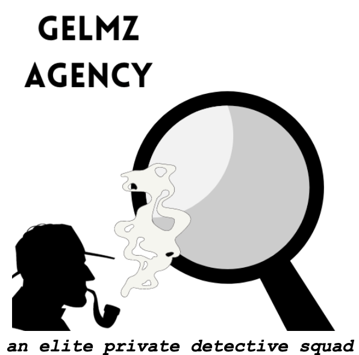

<!-- README.md is generated from README.Rmd. Please edit that file -->

# SDS 235: Visual Analytics - Data Challenge 2

Group Members:

-   Marium Tapal
-   Eleni Partakki
-   Grace Hartley
-   Lilly Campbell
-   Zampa Provenzale

There are two main components to our analysis:

-   the **final report** with all the visualizations and thought process
    explained: `final_report.pdf`
-   a folder with individual code files for all the group members:
    `code\...`

GitHub repo: <https://github.com/mariumtapal/sds235-dc2>

Note: Group members used different languages and software to do their
analysis depending on their preferences. The work was complied in a
Google Doc to remain language agnostic.
