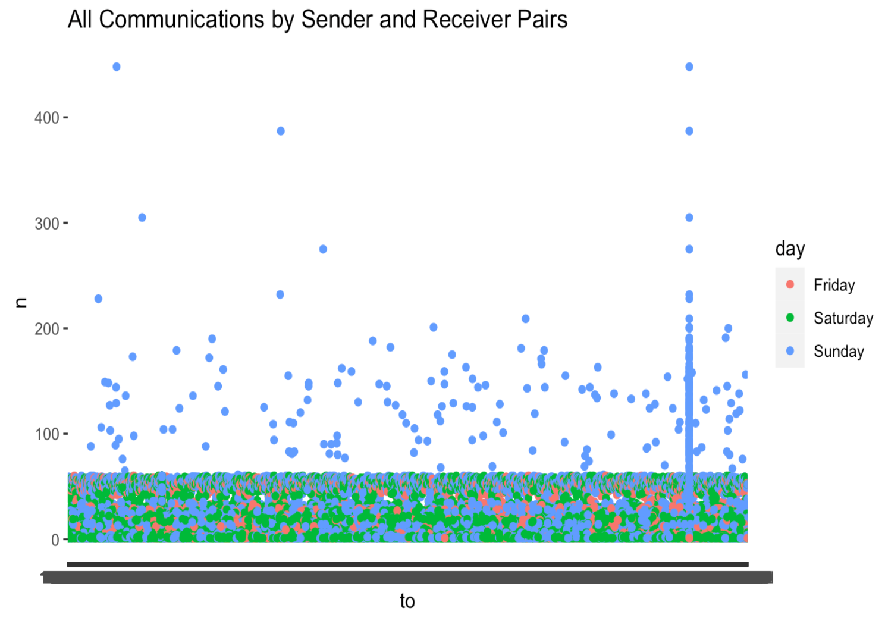
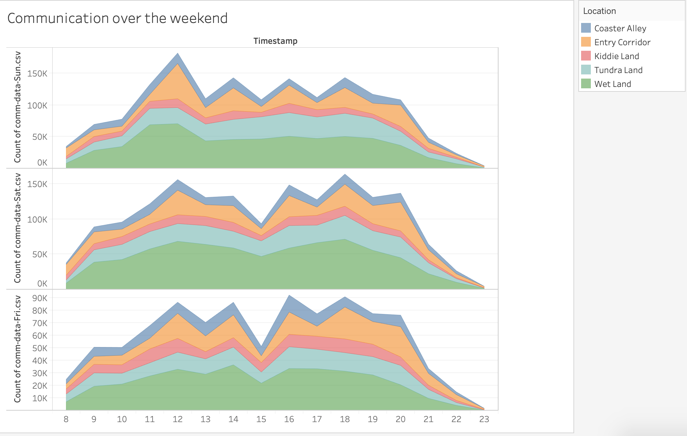
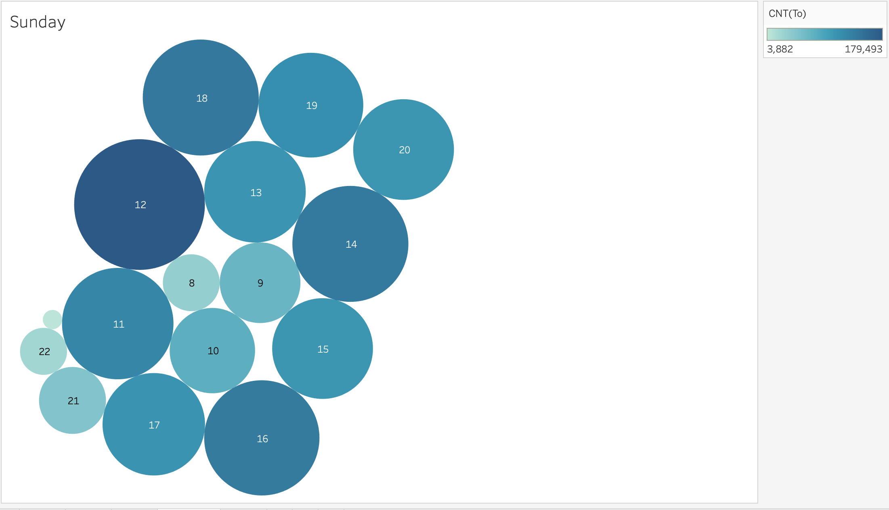
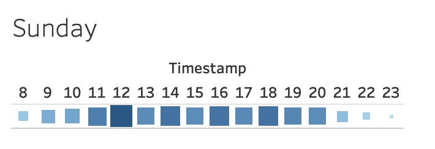

```{r setup, include=FALSE}
knitr::opts_chunk$set(
  echo = TRUE,
  warning = FALSE
)
```

```{r packages, message=FALSE}
library(tidyverse)
library(lubridate)
library(patchwork)
library(raster)
library(plotly)
library(gganimate)
library(knitr)
```

```{r data, message=FALSE}
comm_data_Fri <- read_csv("~/Downloads/DC2-data/Communication Data/comm-data-Fri.csv")
comm_data_Sat <- read_csv("~/Downloads/DC2-data/Communication Data/comm-data-Sat.csv")
comm_data_Sun <- read_csv("~/Downloads/DC2-data/Communication Data/comm-data-Sun.csv")
park_movement_Fri <- read_csv("~/Downloads/DC2-data/Movement Data/park-movement-Fri.csv")
park_movement_Sat <- read_csv("~/Downloads/DC2-data/Movement Data/park-movement-Sat.csv")
park_movement_Sun <- read_csv("~/Downloads/DC2-data/Movement Data/park-movement-Sun.csv")
```

```{r pressure, echo=FALSE, fig.cap="DinoFun World!", out.width = '100%'}
knitr::include_graphics("images/map.png")
```

# **Summary**

DinoFun World is an amusement park declared “Scott Jones Weekend”, where Scott was scheduled to appear in two stage shows each on Friday, Saturday, and Sunday to talk about his life and career. However, the event did not go as planned. Scott’s weekend was marred by crime and mayhem perpetrated by a poor, misguided and disgruntled figure from Scott’s past.

Our mission was to help law enforcement figures understand what happened and to better equip them for future incidents. To help is with our analysis, we used movement and communication data, a map, a short news report, as well as whatever was available on the park's website. We also used a map, a short news report

## What happened during the weekend of the Scott Jones celebration?
We have had a lot of suspicions, but I think we can make an estimated guess about what happened. After reading Scott Jones biography (https://jcrouser.github.io/CSC235/dinofunworld/events-calendar/index.html) where he mentions that “We – Lonzo, Eddie, Marcus and I – played football, er, soccer after school, weekends, every minute we could.  We were always together.  Right after homework was done we’d be out in the street, kicking the ball”, we realized that there may have been an incentive by one of the three friends that Scott had, since we are later informed that "Scott and two of his friends received college scholarships. This ultimately means that one did not. Is that Lonzo? Eddie? or Marcus? We do not know, but we do have some ID information.

We believe that the distraction in the pavilion happened out of jealousy.

### When did the crime occur?

We think that on Sunday, sometime in the morning, right before noon due to the movement and communication data we have gathered.

### Where did the crime take place?

Someone damaged something in the Creighton Pavilion as we knew from the news article that "individuals who vandalized a pavilion exhibiting Jones’s memorabilia and made off with an Olympic medal and possibly other irreplaceable items."

### Who are the most likely suspects in the crime?

We believe it could be Lonzo, Eddie and/or Marcus.

## Characterize different kinds of groups that visited the park on this weekend

We believe there may have been families and school groups during the weekend as there was a large gathering in the Kiddie area, and clusters of id's communicating with each other.

### Are there notable differences in the patterns of activity on in the park across the three days?

The noteable differences in the patterns of activity are the increase in communication at certain parts of the day on Sunday, as a result to the crime. 

### What anomalies or unusual movement patterns do you see?

It is possible that when 575508 and 320392 both went to the pavilion at 12:23 (coming from different directions) they did something (stole the medal?) and left a little less than a minute apart, both traveling to the right. From there 575508 could have ridden Wrightiraptor Mountain again to avoid suspicion, then traveled to Galactasaurus Rage to meet up with 1826870, pass off the medal, and head their separate ways.We think these id's are suspicious. In addition, we looked at numbers 1529852, 1566766, 1131984 and 1934504 around the Kiddie Land area, and this may have been some time of group; a family perhaps.

### Who is communicating, with whom, when and where?

It looks like id:839736 and id:1278894 are communicating the most on each day, with messages exceeding 5000 per day per person. Initially we thought these may have been the suspects, but we are not convinved because the ones committing the crime would not be communicating this actively over the app in fear of being traced. We hypothesize that these are park employees since their communication with visitors is being tracked but not their movement.


### Scott Jones is a VIP (not a paying customer) and therefore does not have an ID. Describe his activities in the park during the three-day weekend.

Some activities that we know Scott participated in based on the calendar of events for the weekend, are a Q&A with the audience, a live demonstration of his soccer moves and two shows daily at the Amazing Scott Showcase Show.

### Were there any issues with park operations during the three-day weekend?

We believe the app may have not always worked as well all the time on all days due to weird communication patterns such as random spikes throughout the weekend and big drops..


# **Further Analysis**


## Communication Data

```{r data-wrangling}
# change timestamp to datetime type from chr
comm_data_Fri$Timestamp <- parse_date_time(comm_data_Fri$Timestamp, "YmdHMS")
comm_data_Sat$Timestamp <- parse_date_time(comm_data_Sat$Timestamp, "YmdHMS")
comm_data_Sun$Timestamp <- parse_date_time(comm_data_Sun$Timestamp, "YmdHMS")

# add day column to data
comm_data_Fri <- comm_data_Fri %>% mutate(day = "Friday")
comm_data_Sat <- comm_data_Sat %>% mutate(day = "Saturday")
comm_data_Sun <- comm_data_Sun %>% mutate(day = "Sunday")

# Make one df
comm_data <- rbind(comm_data_Fri, comm_data_Sat, comm_data_Sun)

# factor ids as levels instead of numeric
comm_data <- comm_data %>% mutate(
  to = as.factor(to),
  from = as.factor(from)
)
```

Looking into the communication data, the question we first looked to answer who was communicating with whom? Are there anomalies? If so, do they tell us anything about solving the crime?

In the initial exploratory data analysis, looking into the total counts of messages sent and received, there were very apparent outliers in the plot below: 

```{r comm-data-1}
# counts of data
sent_data <- comm_data %>%
  group_by(from, day) %>%
  count() %>%
  filter(n > 5000)
p1 <- ggplot(sent_data, aes(x = from, y = n, color = day)) +
  geom_point() +
  labs(title = "Messages Sent")
received_data <- comm_data %>%
  group_by(to, day) %>%
  count() %>%
  filter(n > 5000)
p2 <- ggplot(received_data, aes(x = to, y = n, color = day)) +
  geom_point() +
  labs(title = "Messages Received")
p1 + p2
```

After filtering for these excessive messages, we found that the ID's  839736 and 1278894 (and external person(s)) had an excessive amount of messages sent and received (more than 5000 per day per person):

```{r comm-data-2}
sent_data %>% filter(n > 5000)
received_data %>% filter(n > 5000)
```

Our next step was to track the movements of these individuals, but the movement data does not contain their movements. **We hypothesize that these are park employees since their communication with visitors is being tracked but not their movement.**

Furthering this investigation of what caused these spikes in the number of messages sent and received, we sorted the communications by sender and receiver pairs which hinted that something was happening on Sunday: 

```{r comm-data-3}

```

We then looked into the hourly and minutely data on Sunday for our suspects! IDs 839736 and 1278894.

The graphs below suggest that where there was an abrupt increase of **messages sent** at 12:00 pm which lasted for the next 30 minutes. We think that the other spikes every hour could be regular messages sent by the park employees.

```{r comm-data-4}
comm_data2 <- comm_data %>% mutate(
  hour = hour(Timestamp),
  minute = minute(Timestamp)
)
# Sunday sent messages hourly
hour_sun <- comm_data2 %>%
  filter(from == 839736 | from == 1278894) %>%
  filter(day == "Sunday") %>%
  group_by(from, hour) %>%
  count()
p3 <- ggplot(hour_sun, aes(x = hour, y = n)) +
  geom_line() +
  labs(title = "Messages Sent Per Hour on Sunday")

# look into minutes around on Sunday at noon
hourmin_sun <- comm_data2 %>%
  filter(from == 839736 | from == 1278894) %>%
  filter(day == "Sunday", hour == 12) %>%
  group_by(from, minute) %>%
  count()
p4 <- ggplot(hourmin_sun, aes(x = minute, y = n)) +
  geom_line() +
  labs(title = "Messages Sent By the Minute (Sunday at Noon)")
p3 + p4
```

Similarly we also checked the messages received by our suspects involved in the crime. These graph below also tells that something happened around at noon. Manually plotting the messages received by the minute on Sunday afternoon that the spike continued until 3:40 pm.

```{r comm-data-5}
# Sunday received messages hourly
hour_sun_to <- comm_data2 %>%
  filter(to == 839736 | to == 1278894) %>%
  filter(day == "Sunday") %>%
  group_by(from, hour) %>%
  count()
ggplot(hour_sun_to, aes(x = hour, y = n)) +
  geom_line() +
  labs(title = "Messages Received Per Hour on Sunday")
```

## Movement Data

Beyond communication data, we thought it might be helpful to sort id values based on those most frequently moving around the park.  On Friday the top five ids with the highest amount of movement data are 331284, 1185012, 2065364, 2075534, 171132. Saturday’s id values with the most movement are 999107, 685884, 697057, 1723967, 953651 and Sunday’s are 1529852, 1566766, 1131984, 1934504, 871111. 

```{r move-data-1}
fri_frequent_id <- park_movement_Fri %>%
  group_by(id) %>%
  count(id, sort = TRUE) %>%
  filter(n >= 2900)

sat_frequent_id <- park_movement_Sat %>%
  group_by(id) %>%
  count(id, sort = TRUE) %>%
  filter(n >= 2379)

sun_frequent_id <- park_movement_Sun %>%
  group_by(id) %>%
  count(id, sort = TRUE) %>%
  filter(n >= 2400)

freq_fri_plot <- ggplot(data = fri_frequent_id, aes(x = reorder(id, n), y = n)) +
  geom_bar(stat = "identity") +
  labs(x = "ID value", x = "Number of Movements", title = "ID Values with Most Movements on Friday")
freq_fri_plot

freq_sat_plot <- ggplot(data = sat_frequent_id, aes(x = reorder(id, n), y = n)) +
  geom_bar(stat = "identity") +
  labs(x = "ID value", x = "Number of Movements", title = "ID Values with Most Movements on Saturday")
freq_sat_plot

freq_sun_plot <- ggplot(data = sun_frequent_id, aes(x = reorder(id, n), y = n)) +
  geom_bar(stat = "identity") +
  labs(x = "ID value", x = "Number of Movements", title = "ID Values with Most Movements on Sunday")
freq_sun_plot
```

Since we saw an uptick in communication toward the end of the weekend, we decided to narrow our movement data search to Sunday. We began by statically plotting the locations of each id value, without incorporating the Timestamp variable. As we can see the five ids that moved around the most on Sunday crossed paths quite a bit, namely 1529852, 1566766, 1131984 and 1934504 around the Kiddie Land area.  

```{r move-data-2}
sun_1529852 <- park_movement_Sun %>%
  group_by(id) %>%
  summarize(Timestamp, type, X, Y) %>%
  filter(id == 1529852 | id == 1566766 | id == 1131984 | id == 1934504 | id == 871111) %>%
  slice(1:50)
sun_1529852
gg <- ggplot(sun_1529852, aes(X, Y, color = id, ids = id)) +
  geom_point(aes(frame = Timestamp)) +
  labs(x = "X Coordinate", y = "Y Coordinate", title = "Locations of Most Frequently Moving ID Values")
gg
```

When factoring time, we noticed that almost none of the top five most frequently moving ids on sunday overlapped with each other – that is, each id was found moving at a different time. This could be a coincidence (maybe workers were transporting a specific tool across DINOFUN WORLD). However, this makes us suspicious that these particular id were meeting up for nefarious reasons.  

```{r move-data-3}
ggplotly(gg)
```

To narrow the amount of movement data we were looking at, we filtered the data down to movements between 12 and 12:30 PM, as that is when the abrupt increase in messages sent occurred. Furthermore, we know the crime occurred at the Creighton Pavilion, so we filtered the movement data to only include coordinates encompassing the pavilion (between 20 and 45 for X and 15 and 40 for Y). 

```{r}
# filter data to just include times 12-12:30 on Sunday and the pavillion (32 on map)
pavillion_data <- park_movement_Sun %>%
  filter(Timestamp > "2014-6-08 12:00:00" & Timestamp < "2014-6-08 12:31:00") %>%
  filter(X > 20 & X < 45) %>%
  filter(Y > 10 & Y < 40)
```

To get an idea of who was most active around the pavilion within this time frame, we grouped by ID and took the top 3 ids with the largest number of movements. These were 575508, 320392, and 1826870, which had 93, 90, and 88 movements, respectively. Looking at their movements over time, they all have an interesting pattern of walking different sections around the pavilion, often doubling back. Furthermore, looking at how their movements overlap is interesting.

```{r}
# check which ids had most movements around here at this time
pavillion_data %>%
  group_by(id) %>%
  count(id, sort = TRUE) %>%
  filter(n > 80)

# filter to top id 575508
pavillion_frequent1 <- pavillion_data %>%
  filter(id == 575508)

# filter to second top id 320392
pavillion_frequent2 <- pavillion_data %>%
  filter(id == 320392)

# filter to third top id 1826870
pavillion_frequent3 <- pavillion_data %>%
  filter(id == 1826870)
```

575508 is the id that looks the most suspicious. Their movement starts out at 12:10, when they go and check into Wrightiraptor Mountain ride. They ride this twice. Then they go to the pavilion around 12:23, leave and go back to the same ride and do it a third time. Following this, they leave and go to the left, passing the Galactasaurus Rage ride at 12:29 but not riding it. See figures 1 and 2.

```{r}
fig1 <- pavillion_frequent1 %>%
  plot_ly(
    x = ~X,
    y = ~Y,
    type = "scatter",
    mode = "markers",
    color = ~id,
    colors = "dark green",
    text = ~Timestamp,
    title = "Figure 1: Static Plot of 575508's movement from 12 to 12:30 PM"
  ) %>%
  layout(
    images = list(
      source = "https://raw.githubusercontent.com/mariumtapal/sds235-dc2/main/images/Park%20Map.jpg",
      xref = "x",
      yref = "y",
      x = 0,
      y = 99,
      sizex = 100,
      sizey = 100,
      sizing = "stretch",
      opacity = 0.4,
      layer = "below"
    )
  )

fig1 <- fig1 %>% layout(
  xaxis = list(range = c(0, 99)),
  yaxis = list(range = c(0, 99))
)

fig1
```

```{r}
fig2 <- pavillion_frequent1 %>%
  plot_ly(
    x = ~X,
    y = ~Y,
    frame = ~Timestamp,
    type = "scatter",
    mode = "markers",
    color = ~id,
    colors = "dark green",
    text = ~Timestamp,
    title = "Figure 2: Animated Plot of 575508's movement over time"
  ) %>%
  layout(
    images = list(
      source = "https://raw.githubusercontent.com/mariumtapal/sds235-dc2/main/images/Park%20Map.jpg",
      xref = "x",
      yref = "y",
      x = 0,
      y = 99,
      sizex = 100,
      sizey = 100,
      sizing = "stretch",
      opacity = 0.4,
      layer = "below"
    )
  )

fig2 <- fig2 %>% layout(
  xaxis = list(range = c(0, 99)),
  yaxis = list(range = c(0, 99))
)

fig2
```

320392’s movement starts at 12:07, and they go to the pavilion at 12:08. Then they turn and go back the way they came, going down to ride the Galactasaurus Rage at 12:11 and leaving it at 12:20. From there they go back into the pavilion at 12:23 and then travel on to the right. See figures 3 and 4.

```{r}
fig3 <- pavillion_frequent2 %>%
  plot_ly(
    x = ~X,
    y = ~Y,
    type = "scatter",
    mode = "markers",
    color = ~id,
    colors = "blue",
    text = ~Timestamp,
    title = "Figure 3: Static Plot of 320392's movement from 12 to 12:30 PM"
  ) %>%
  layout(
    images = list(
      source = "https://raw.githubusercontent.com/mariumtapal/sds235-dc2/main/images/Park%20Map.jpg",
      xref = "x",
      yref = "y",
      x = 0,
      y = 99,
      sizex = 100,
      sizey = 100,
      sizing = "stretch",
      opacity = 0.4,
      layer = "below"
    )
  )

fig3 <- fig3 %>% layout(
  xaxis = list(range = c(0, 99)),
  yaxis = list(range = c(0, 99))
)

fig3
```

```{r}
fig4 <- pavillion_frequent2 %>%
  plot_ly(
    x = ~X,
    y = ~Y,
    frame = ~Timestamp,
    type = "scatter",
    mode = "markers",
    color = ~id,
    colors = "blue",
    text = ~Timestamp,
    title = "Figure 4: Animated Plot of 320392's movement over time"
  ) %>%
  layout(
    images = list(
      source = "https://raw.githubusercontent.com/mariumtapal/sds235-dc2/main/images/Park%20Map.jpg",
      xref = "x",
      yref = "y",
      x = 0,
      y = 99,
      sizex = 100,
      sizey = 100,
      sizing = "stretch",
      opacity = 0.4,
      layer = "below"
    )
  )

fig4 <- fig4 %>% layout(
  xaxis = list(range = c(0, 99)),
  yaxis = list(range = c(0, 99))
)

fig4
```

Finally, 1826870 starts at 12:09 and goes past the pavilion but not into it at 12:10. From there they go down to the atmosfear ride, which they check into at 12:12. When they leave at 12:14 they go back the way they came, and this time go into the pavilion at 12:16. Then they go and check in to Galactasaurus Rage at 12:20, which they exit at 12:29. They exit the ride at the exact time id 575508 is passing by the ride, but then they go in the opposite direction of 575508. 

```{r}
fig5 <- pavillion_frequent3 %>%
  plot_ly(
    x = ~X,
    y = ~Y,
    type = "scatter",
    mode = "markers",
    color = ~id,
    colors = "black",
    text = ~Timestamp,
    title = "Figure 5: Static Plot of 1826870's movement from 12 to 12:30 PM "
  ) %>%
  layout(
    images = list(
      source = "https://raw.githubusercontent.com/mariumtapal/sds235-dc2/main/images/Park%20Map.jpg",
      xref = "x",
      yref = "y",
      x = 0,
      y = 99,
      sizex = 100,
      sizey = 100,
      sizing = "stretch",
      opacity = 0.4,
      layer = "below"
    )
  )

fig5 <- fig5 %>% layout(
  xaxis = list(range = c(0, 99)),
  yaxis = list(range = c(0, 99))
)

fig5
```

```{r}
fig6 <- pavillion_frequent3 %>%
  plot_ly(
    x = ~X,
    y = ~Y,
    frame = ~Timestamp,
    type = "scatter",
    mode = "markers",
    color = ~id,
    colors = "black",
    text = ~Timestamp,
    title = "Figure 6: Animated Plot of 1826870's movement over time"
  ) %>%
  layout(
    images = list(
      source = "https://raw.githubusercontent.com/mariumtapal/sds235-dc2/main/images/Park%20Map.jpg",
      xref = "x",
      yref = "y",
      x = 0,
      y = 99,
      sizex = 100,
      sizey = 100,
      sizing = "stretch",
      opacity = 0.4,
      layer = "below"
    )
  )

fig6 <- fig6 %>% layout(
  xaxis = list(range = c(0, 99)),
  yaxis = list(range = c(0, 99))
)

fig6
```

In putting all of these together, it is hard to know if these are just coincidences or suspicious activity. However, it is possible that when 575508 and 320392 both went to the pavilion at 12:23 (coming from different directions) they did something (stole the medal?) and left a little less than a minute apart, both traveling to the right. From there 575508 could have ridden Wrightiraptor Mountain again to avoid suspicion, then traveled to Galactasaurus Rage to meet up with 1826870, pass off the medal, and head their separate ways. Again, it is definitely possible these are just park visitors enjoying these rides, but because of the time frame and the location it feels significant. Maybe they were actually riding the rides to kill time before scheduled meet ups and to appear less conspicuous. 

Looking at the communications data for messages to 839736 and 1278894 (the two significant IDs) and searched for the three IDs above (575508, 320392, and 1826870). There are two messages from 575508 to 839736 at 12:23 pm, which would have been the time that 575508 and 320392 would have entered the pavilion. Additionally, there are five messages from 320392 to 839736: one at 12:08, when 320392 is at the pavilion the first time; two at 12:23, when they get to it the second time; and two at 12:24, when they are leaving the pavilion. Finally, there are four messages from 1826870 to 839736: two at 12:16, when 1826870 enters the pavilion, and two at 12:43 (when looking at the data for this ID at 12:43 and it appears they are back at the pavilion). This definitely seems to incriminate 575508, 320392, and 1826870 more! It is possible that 839736 is a facilities worker at the park, and these IDs were all reporting the vandalism at the pavilion, but we're not so sure about that.

### **Insertion from Tableau**

### Communication over the weekend

Communication over the weekend seems to be somewhat steady except strange drops. This may be a result of a break in the app, or perhaps partial breaks in the app for some areas. That can be clearly seen on Saturday midday.



As my partners and I started closing in on Sunday being the day of the crime, I visualized the peak hours of communication, and those are at noon. My thought is that the crime must have happened right before that hour, and as a result people are calling/texting to figure out what is happening.



Due to my mistrust of circles and pie chart look-alikes, I checked the hours on Sunday with a different visualization that also clarified my point about the crime happening before or right around noon.



# **Conslusion**

Overall, we may not have names, but someone did commit a crime, and it happened on Sunday at the Pavilion. It was a busy weekend with many people up to something, now the question remains if they were the ones that were up to no good.
